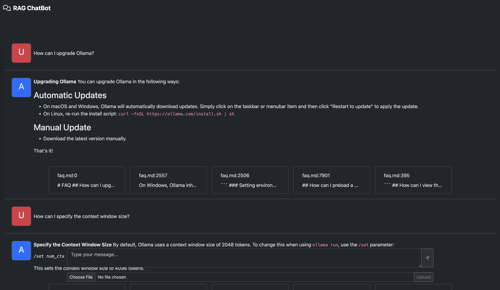
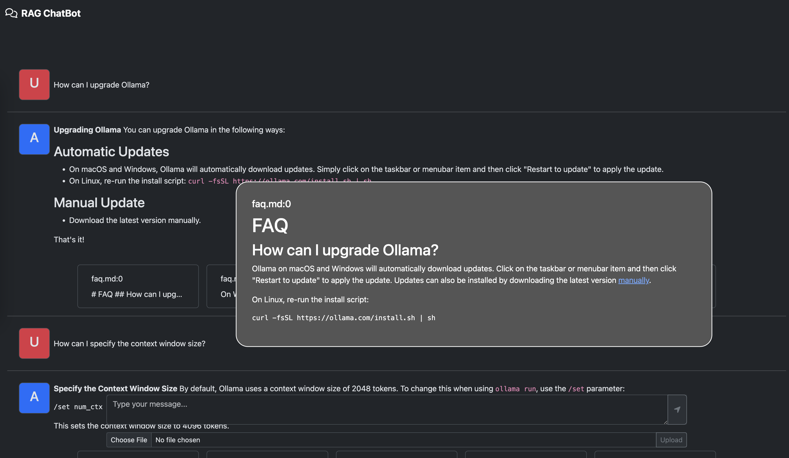

    <h1>RAG Chatbot<h1>

    
    
    

## Overview
The RAG Chatbot is a conversational AI application that utilizes LLM to provide users with relevant information and responses.

## Components

- `query.py`: Contains the Python script responsible for querying the RAG model and generating responses.

- `populate_db.py`: A Python script used to populate the database with relevant data and sources.

- `web.py`: The Flask web framework code that handles HTTP requests and serves as the backend for the chatbot's interface.

- `index.html`: The HTML template for the chatbot's user interface.

- `index.js`: A JavaScript file that contains the client-side logic.

## Features

- The chatbot responds with relevant information and sources, which are displayed below the input field.

- Users can view detailed information about each source by hovering over the source card.

- The chatbot also supports uploading files through web interface.

## Screenshots

## Getting Started

1. Clone this repository using `git clone https://github.com/AaLexUser/Rag-chatbot.git`

2. Install dependencies by running pip `install -r requirements.txt` in the project root directory.

3. Run the Flask application using `python web.py` to start the chatbot's backend.

4. Open a web browser and navigate to `http://localhost:5000/` to access the chatbot's interface.

## License

This project is licensed under the MIT License. See [LICENSE](LICENSE) for details.
